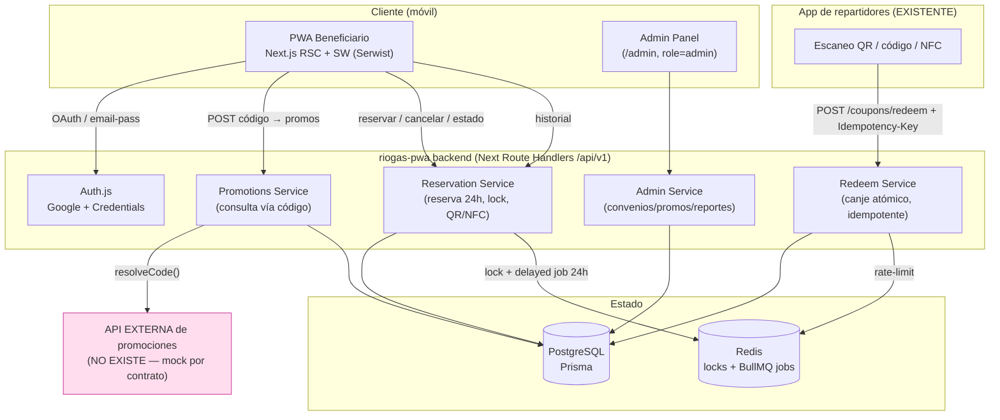

# Arquitectura técnica — riogas-pwa (MVP)

> **Rol:** IT Architect · **Fecha:** 2026-06-10 · **Estado:** Propuesta para scaffold
> **Insumos:** `riogas-pwa-mvp-spec.md`, `riogas-pwa-mvp-functional-spec.md` (analyst) + contexto de producto vigente.
> **Entregables asociados:** `docs/specs/riogas-pwa/openapi.yaml` (contratos), `docs/specs/riogas-pwa/mocks/*.json` (respuestas mock).

---

## 0. Reconciliación de specs (decisión de arquitectura)

Las specs funcionales del analyst describen un modelo **CI + teléfono + OTP contra un padrón cargado por CSV**, donde la identidad del beneficiario *es* la entitlement. El contexto de producto vigente cambia dos supuestos fundamentales, y como arquitecto los adopto explícitamente:

| Tema | Spec analyst (v1) | Dirección vigente (v2 — adoptada) | Impacto |
| --- | --- | --- | --- |
| **Autenticación** | CI + teléfono + OTP SMS contra padrón | **Google OAuth o email/password**; teléfono obligatorio; resto de datos opcionales | Identidad = cuenta de app, no padrón. Se elimina dependencia de OTP SMS para login. |
| **Entitlement** | Cupón pre-emitido y asignado a CI en el padrón | **Código libre único** (CI, nº de funcionario o key SMS/WhatsApp) resuelto por **API externa aún inexistente** | La elegibilidad se descubre en runtime, no se pre-emite. Se desacopla *identidad* de *beneficio*. |
| **Fuente de verdad de promos** | DB propia (lotes/campañas) | **API externa** (convenios/promociones/usos) + caché local | Se necesita capa de integración + mock contractual. |

**Consecuencia central:** el sistema separa **`Usuario`** (quien se loguea) de **`Beneficiario`** (entidad resuelta al canjear un código contra la API externa). Un usuario puede vincular uno o más códigos; cada código resuelve a un conjunto de promociones con usos restantes. La reserva 24h, el QR/NFC, el historial y la validación por la app de repartidores se conservan tal cual de las specs del analyst.

Lo que **se mantiene** de las specs del analyst: máquina de estados del cupón, regla de reserva 24h, idempotencia de canje, separación de roles (beneficiario / admin / repartidor-por-API), requisitos no funcionales (QR firmado, auditoría de transiciones, atomicidad de canje, p95).

---

## 1. Stack recomendado

Alineado con la casa (monorepo AICOS: Next.js, Redis, BullMQ, Prometheus, Caddy/Docker) para reutilizar infra y CI.

| Capa | Tecnología | Justificación |
| --- | --- | --- |
| **PWA + Admin** | **Next.js 14 (App Router) + TypeScript** | SSR/RSC, mismo runtime que `apps/dashboard`. Un solo deploy sirve PWA beneficiario (`/`) y Admin (`/admin`) con segmentación por rol. |
| **PWA shell** | **Serwist** (`@serwist/next`) | Service worker, manifest, install prompt, precache del app-shell. Mantenemos "siempre requiere internet" → SW cachea shell/estáticos, **no** transacciones. |
| **Auth** | **Auth.js (NextAuth v5)** — provider Google + Credentials (email/password) | OAuth + email/password en una sola librería. JWT de sesión con `role`. Teléfono obligatorio se exige en onboarding post-signup. |
| **API** | **Route Handlers** Next (`app/api/v1/**`) | Co-localizado, sin servicio extra para MVP. Si crece, se extrae a `services/`. |
| **Validación** | **Zod** | Esquemas compartidos request/response, fuente de los tipos TS y de la doc OpenAPI. |
| **ORM / DB** | **Prisma + PostgreSQL** | Transacciones atómicas para canje (requisito CA-R01), migraciones versionadas. |
| **Cache / locks / colas** | **Redis + BullMQ** | Lock de reserva (evita doble reserva), **job de expiración 24h** (delayed job por reserva), rate-limit del endpoint de canje. Ya en uso en el monorepo. |
| **Integración externa** | Cliente HTTP tipado + **mock server** (contrato OpenAPI) | La API de promociones no existe → se programa contra el contrato mock con feature flag `PROMOS_PROVIDER=mock|live`. |
| **QR** | `qrcode` (render) + JWT firmado (payload) | QR = token firmado (JWS) con `cuponId`+`jti`, no datos personales (req. privacidad). |
| **NFC** | **Web NFC API** (`NDEFReader`) progressive enhancement | Solo Chrome/Android; feature-detect, fallback a QR/código. |
| **UI** | Tailwind + shadcn/ui + lucide (igual que `apps/dashboard`) | Consistencia visual con la casa, mobile-first. |
| **Observabilidad** | `prom-client` (Prometheus) + logs estructurados con `requestId` | Métricas de canje (latencia p95, tasa de error) y auditoría de transiciones. |
| **Infra** | Docker + Caddy (reverse proxy/TLS) | Patrón ya usado en `infra/`. |

**Descartados / tradeoffs:** ver §6.

---

## 2. Diagrama lógico



**Flujos clave:**
1. **Login →** Auth.js emite sesión (`role=beneficiario`). Onboarding fuerza teléfono.
2. **Consulta de promos →** usuario ingresa un código libre → `PROMO.resolveCode(code)` llama a la API externa (mock) → devuelve promociones `available/unavailable/used` + `usosRestantes`. Se persiste/actualiza `Beneficiario` (snapshot) vinculado al usuario.
3. **Reserva →** usuario elige promo → `RES` toma lock Redis, crea `Cupon` en `RESERVADO`, genera código alfanumérico de 8, firma QR, programa job BullMQ a `reservedAt+24h`.
4. **Canje →** app de repartidores (existente) llama `POST /api/v1/coupons/redeem` con QR/código/NFC + `Idempotency-Key` → transacción atómica a `CANJEADO`, decrementa uso, registra `Canje`.
5. **Expiración →** job 24h libera reserva (`RESERVADO → DISPONIBLE`, o `EXPIRADO` si el convenio venció).

---

## 3. Entidades principales (modelo de datos)

Esquema lógico (Prisma-flavored). Tiempos en UTC.

```prisma
// ── Identidad de la app ─────────────────────────────────────────
model Usuario {
  id            String   @id @default(cuid())
  email         String   @unique
  emailVerified DateTime?
  passwordHash  String?              // null si solo OAuth
  googleId      String?  @unique     // null si solo credentials
  nombre        String?
  telefono      String               // OBLIGATORIO (validado en onboarding, formato E.164)
  role          Role     @default(BENEFICIARIO)
  createdAt     DateTime @default(now())
  updatedAt     DateTime @updatedAt

  beneficiarios Beneficiario[]       // códigos vinculados
  cupones       Cupon[]
}

enum Role { BENEFICIARIO ADMIN }

// ── Entitlement resuelto vía código (cache de API externa) ──────
model Beneficiario {
  id            String   @id @default(cuid())
  usuarioId     String
  usuario       Usuario  @relation(fields: [usuarioId], references: [id])
  codigo        String                 // código libre tal cual lo ingresó
  codigoTipo    CodigoTipo @default(DESCONOCIDO)  // resuelto por API externa
  externalRef   String?                // id del beneficiario en sistema externo
  nombreExterno String?                // nombre devuelto por API externa (opcional)
  resolvedAt    DateTime               // última sync con API externa
  raw           Json?                  // payload crudo de la API externa (auditoría)

  cupones       Cupon[]
  @@unique([usuarioId, codigo])        // un usuario no duplica el mismo código
  @@index([codigo])
}

enum CodigoTipo { CI FUNCIONARIO KEY_SMS DESCONOCIDO }

// ── Catálogo (gestionado en Admin; reflejo de convenios externos) ─
model Convenio {
  id          String   @id @default(cuid())
  nombre      String
  partner     String?               // empresa/ente del convenio
  externalRef String?  @unique      // id del convenio en API externa
  vigenteDesde DateTime
  vigenteHasta DateTime
  estado      ConvenioEstado @default(ACTIVO)
  createdAt   DateTime @default(now())

  promociones Promocion[]
}

enum ConvenioEstado { ACTIVO PAUSADO FINALIZADO }

model Promocion {
  id           String   @id @default(cuid())
  convenioId   String
  convenio     Convenio @relation(fields: [convenioId], references: [id])
  externalRef  String?               // id de la promo en API externa
  nombre       String
  descripcion  String?
  producto     String                // p.ej. "Garrafa 13kg"
  beneficio    String                // texto del descuento/beneficio
  maxUsos      Int      @default(1)  // usos por beneficiario/código
  stockGlobal  Int?                  // null = sin tope global
  vigenteDesde DateTime
  vigenteHasta DateTime
  estado       PromocionEstado @default(ACTIVA)
  reglas       Json?                 // condiciones libres

  cupones      Cupon[]
  @@index([convenioId, estado])
}

enum PromocionEstado { ACTIVA PAUSADA FINALIZADA }

// ── Cupón / Reserva ─────────────────────────────────────────────
model Cupon {
  id                    String   @id @default(cuid())
  usuarioId             String
  usuario               Usuario  @relation(fields: [usuarioId], references: [id])
  beneficiarioId        String
  beneficiario          Beneficiario @relation(fields: [beneficiarioId], references: [id])
  promocionId           String
  promocion             Promocion @relation(fields: [promocionId], references: [id])

  estado                CuponEstado @default(RESERVADO)
  codigoAlfanumerico    String   @unique          // 8 chars, p.ej. "RG4F8A2K"
  qrJti                 String   @unique          // jti del JWS del QR (revocable)
  reservedAt            DateTime
  reservationExpiresAt  DateTime                  // reservedAt + 24h
  canceledAt            DateTime?
  createdAt             DateTime @default(now())

  canje                 Canje?
  @@index([usuarioId, estado])
  @@index([reservationExpiresAt])                 // barrido de expiración
}

// Estados del cupón (de la spec del analyst). En v2 el cupón NACE en RESERVADO
// (se crea al reservar). DISPONIBLE/AGOTADO viven en la Promoción, no en el Cupón.
enum CuponEstado { RESERVADO CANJEADO EXPIRADO CANCELADO }

// ── Canje (transacción del repartidor) ──────────────────────────
model Canje {
  id              String   @id @default(cuid())
  cuponId         String   @unique
  cupon           Cupon    @relation(fields: [cuponId], references: [id])
  repartidorId    String                  // id en sistema de repartidores
  vehiculoId      String?
  mecanismo       MecanismoLectura        // QR | CODIGO | NFC
  idempotencyKey  String   @unique        // dedupe de reintentos
  redeemedAt      DateTime @default(now())
  geo             Json?
}

enum MecanismoLectura { QR CODIGO NFC }

// ── Auditoría de transiciones (req. observabilidad) ─────────────
model AuditEvent {
  id         String   @id @default(cuid())
  entityType String                       // "Cupon" | "Convenio" | ...
  entityId   String
  fromState  String?
  toState    String?
  actorType  String                       // "USUARIO" | "ADMIN" | "REPARTIDOR" | "SYSTEM"
  actorId    String?
  requestId  String?
  meta       Json?
  createdAt  DateTime @default(now())
  @@index([entityType, entityId])
}
```

**Notas de modelado:**
- **`DISPONIBLE`/`AGOTADO` se modelan a nivel `Promocion` (disponibilidad + stock), no a nivel `Cupon`.** El `Cupon` solo existe cuando se reserva → nace en `RESERVADO`. Esto encaja con v2 (la promo se descubre disponible vía API externa; el cupón se materializa al reservar). Se documenta el mapeo a la máquina de estados del analyst en el OpenAPI.
- **Unicidad de reserva activa:** garantizada por lock Redis + constraint lógico (un `Cupon` en `RESERVADO` por `(usuarioId, promocionId)`).
- **QR sin PII:** el QR sólo lleva un JWS con `cuponId` + `qrJti`; cancelar/expirar rota `qrJti` invalidando el anterior.

---

## 4. Contratos API (mock) — resumen

Contrato completo y ejecutable: **`docs/specs/riogas-pwa/openapi.yaml`** (OpenAPI 3.1). Mocks de ejemplo en **`docs/specs/riogas-pwa/mocks/`**. Resumen de los tres contratos pedidos por la tarea:

### 4.1 Consulta de promociones (vía código) — **PWA backend**
`POST /api/v1/promotions/lookup` · `Authorization: Bearer <jwt>`
```jsonc
// Request
{ "codigo": "12345672" }                       // código libre, sin elegir tipo
// Response 200
{
  "beneficiario": { "id": "ben_1", "codigoTipo": "CI", "nombreExterno": "Juan P." },
  "promociones": [
    { "promocionId": "promo_13kg", "convenio": "Subsidio Junio",
      "nombre": "Descuento garrafa 13kg", "estado": "AVAILABLE",
      "usosRestantes": 2, "usosMax": 3, "vigenteHasta": "2026-06-30T23:59:59Z" },
    { "promocionId": "promo_3kg", "nombre": "Garrafa 3kg",
      "estado": "USED", "usosRestantes": 0, "usosMax": 1 },
    { "promocionId": "promo_supergas", "nombre": "Supergás 45kg",
      "estado": "UNAVAILABLE", "motivo": "OUT_OF_STOCK" }
  ]
}
```
Estados de promo en la respuesta: `AVAILABLE | UNAVAILABLE | USED`. Errores: `400` código inválido, `404 CODE_NOT_FOUND`, `502 PROVIDER_UNAVAILABLE` (API externa caída).

### 4.2 Reserva — **PWA backend**
`POST /api/v1/promotions/{promocionId}/reserve` · `Authorization: Bearer <jwt>` · body `{ "beneficiarioId": "ben_1" }`
```jsonc
// Response 201
{
  "cuponId": "cup_123",
  "estado": "RESERVADO",
  "codigoAlfanumerico": "RG4F8A2K",            // 8 chars
  "qrPayload": "eyJhbGciOi...",                // JWS para QR
  "nfcPayload": "RG4F8A2K",                    // texto NDEF (si device soporta)
  "reservedAt": "2026-06-10T13:00:00Z",
  "reservationExpiresAt": "2026-06-11T13:00:00Z"
}
```
Errores: `409 ALREADY_RESERVED` (reserva activa para esa promo), `409 NO_USES_LEFT`, `410 PROMOTION_EXPIRED`, `423 OUT_OF_STOCK`.

### 4.3 Estado del cupón / reserva — **PWA backend**
`GET /api/v1/coupons/{cuponId}` · `Authorization: Bearer <jwt>`
```jsonc
{
  "cuponId": "cup_123", "estado": "RESERVADO",
  "codigoAlfanumerico": "RG4F8A2K", "qrPayload": "eyJ...",
  "reservationExpiresAt": "2026-06-11T13:00:00Z",
  "secondsRemaining": 84230
}
```
`POST /api/v1/coupons/{cuponId}/cancel` → `{ "estado": "CANCELADO" }`.
`GET /api/v1/coupons?from=&to=&estado=` → historial paginado por fecha (P-B05).

### 4.4 Contratos secundarios (en el OpenAPI completo)
- **Canje (repartidor):** `POST /api/v1/coupons/redeem` (+`Idempotency-Key`) — atómico, idempotente, rate-limited. (igual a CA-R01/R02 del analyst.)
- **API externa (a mockear):** `POST /external/v1/beneficiarios/resolve` — el contrato que el proveedor *debe* implementar; lo mockeamos para destrabar el scaffold.
- **Admin:** CRUD `convenios`, `promociones`; `GET /reports/summary`.

---

## 5. Integración con la API externa (no existe aún)

- **Contrato propuesto** (`/external/v1/...` en el OpenAPI) que el proveedor debe cumplir: dado un `codigo`, devuelve `codigoTipo`, `beneficiarioRef` y la lista de promociones con `usosRestantes`. **Nosotros publicamos el contrato; ellos implementan.**
- **Adapter pattern:** interface `PromotionsProvider { resolveCode(code), confirmReserve(...), confirmRedeem(...) }` con dos implementaciones: `MockProvider` (lee de `mocks/` + DB seed) y `HttpProvider` (live). Flag `PROMOS_PROVIDER=mock|live`.
- **Caché + consistencia:** la respuesta se cachea en `Beneficiario.raw` con TTL corto (p.ej. 60s) para la pantalla; **la reserva y el canje revalidan contra el provider** (o, si el proveedor expone confirmación, hacen `confirmReserve`/`confirmRedeem`) para no sobre-vender stock.
- **Degradación:** si la API externa está caída → `502 PROVIDER_UNAVAILABLE`; la PWA muestra estado de error y permite reintento (siempre requiere internet, sin fallback offline transaccional).

---

## 6. Tradeoffs explícitos

| Decisión | Alternativa | Por qué la elegida | Costo aceptado |
| --- | --- | --- | --- |
| **Monolito Next (API en Route Handlers)** | Backend separado en `services/` (NestJS/Fastify) | Velocidad de MVP, un deploy, mismo stack que `dashboard` | Si el tráfico de canje crece, habrá que extraer el Redeem Service. Diseñado para extracción (servicios desacoplados). |
| **Admin dentro de la misma app (`/admin`)** | App admin separada | Menos infra, sesión/role compartidos | Bundle compartido; mitigado con route groups y RBAC en middleware. |
| **PostgreSQL + Prisma** | DynamoDB / Firestore | Transacción atómica de canje es requisito duro (CA-R01); SQL lo da natural | Operar Postgres. |
| **Job 24h con BullMQ delayed** | Cron de barrido cada minuto | Precisión por-reserva, menos carga; ya hay Redis | Depende de Redis; mitigado con índice `reservationExpiresAt` para barrido de respaldo (reconciliación). |
| **Cupón nace en `RESERVADO`** | Pre-emitir cupones `DISPONIBLE` (v1 analyst) | En v2 la elegibilidad es dinámica vía API externa; pre-emitir no aplica | `DISPONIBLE`/`AGOTADO` se mueven a `Promocion`. Documentado en §3. |
| **QR = JWS firmado** | QR con código plano | No expone PII, revocable por `jti`, verificable offline por el backend | Tamaño de QR mayor; aceptable. |
| **Auth.js (Google + Credentials)** | OTP SMS (v1 analyst) | Producto pidió OAuth/email; menos costo de SMS, mejor UX | Se pierde verificación de teléfono "fuerte"; mitigable con verificación SMS opcional del teléfono obligatorio (fase 2). |
| **Web NFC (progressive enhancement)** | Solo QR | Producto lo pide donde el device lo permita | Solo Android/Chrome; feature-detect + fallback obligatorio a QR/código. |

---

## 7. Riesgos

| # | Riesgo | Prob. | Impacto | Mitigación |
| --- | --- | --- | --- | --- |
| R1 | **API externa no existe / contrato cambia** | Alta | Bloqueante | Adapter + contrato OpenAPI publicado + MockProvider. Scaffold avanza sin el proveedor. |
| R2 | **Sobre-venta de stock** entre consulta y reserva | Media | Alto | Lock Redis + revalidación/`confirmReserve` contra provider en el momento de reservar; stock no se confía del snapshot cacheado. |
| R3 | **Doble canje / reintentos** del repartidor | Media | Alto | `Idempotency-Key` único + transacción atómica + estado terminal `CANJEADO`. |
| R4 | **Teléfono no verificado** (OAuth no prueba posesión) | Media | Medio | Teléfono obligatorio en onboarding; verificación SMS del teléfono como fase 2 si negocio lo exige. |
| R5 | **NFC no soportado** (iOS Safari) | Alta | Bajo | Progressive enhancement; QR + código alfanumérico siempre presentes. |
| R6 | **Expiración 24h no dispara** (Redis caído) | Baja | Medio | Job BullMQ + barrido de reconciliación por índice `reservationExpiresAt`. |
| R7 | **Suplantación de QR** | Baja | Alto | JWS firmado con clave del backend, `jti` revocable, validación server-side en canje. |
| R8 | **Identidad ≠ entitlement** (un usuario ingresa código de otro) | Media | Medio | El código se valida contra API externa; el negocio define si requiere prueba adicional (key SMS ya implica posesión). Auditoría en `Beneficiario.raw`. |

---

## 8. Layout de proyecto propuesto (scaffold)

```
apps/riogas-pwa/
├─ src/
│  ├─ app/
│  │  ├─ (beneficiario)/            # P-B01..P-B06
│  │  │  ├─ page.tsx                # home / estado
│  │  │  ├─ login/                  # Auth.js
│  │  │  ├─ codigo/                 # ingreso de código + promos
│  │  │  ├─ cupon/[id]/             # reserva activa (QR/NFC/código)
│  │  │  └─ historial/
│  │  ├─ admin/                     # P-A01..P-A04 (role=ADMIN)
│  │  └─ api/v1/                    # Route Handlers (ver openapi.yaml)
│  │     ├─ promotions/lookup/
│  │     ├─ promotions/[id]/reserve/
│  │     ├─ coupons/[id]/ , coupons/redeem/
│  │     └─ admin/...
│  ├─ lib/
│  │  ├─ providers/                 # PromotionsProvider (mock | http)
│  │  ├─ auth.ts                    # Auth.js config
│  │  ├─ qr.ts , nfc.ts             # JWS QR + Web NFC
│  │  └─ db.ts                      # Prisma client
│  ├─ schemas/                      # Zod (compartido con openapi)
│  └─ middleware.ts                 # RBAC
├─ prisma/schema.prisma             # §3
├─ workers/expire-reservation.ts    # BullMQ job 24h
└─ ...                              # next.config (Serwist), Dockerfile, etc.
```

## 9. Done — checklist de arquitectura

- [x] Stack recomendado con justificación y tradeoffs.
- [x] Diagrama lógico (componentes + flujos + dependencia externa marcada).
- [x] Entidades: `Usuario`, `Beneficiario`, `Convenio`, `Promocion`, `Cupon`/Reserva, `Canje` (+ auditoría) con esquema Prisma.
- [x] Contratos mock: consulta de promociones, reserva, estado (+ canje, externo, admin) → `openapi.yaml` + `mocks/`.
- [x] Integración con API futura: contrato publicado + adapter + degradación.
- [x] Riesgos y mitigaciones.
- [x] Layout de scaffold suficiente para que dev comience.
